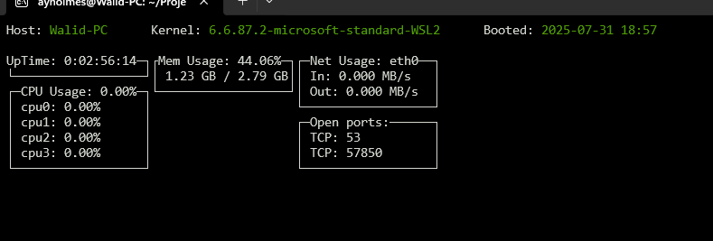

# Linux System Diagnostic Dashboard

This tool is a simple terminal-based system monitoring tool written in C++. It displays real-time system information in a structured ncurses interface.

## Features

- CPU usage (total and per-core)
- Memory usage (available and total, in GB)
- System uptime (formatted as DD:HH:MM:SS)
- Network usage (MB/s received and sent on the wan interface)
- Open ports (TCP and UDP)
- Basic system info (hostname, kernel version, boot time)

## Build & Run

```bash
make
./bin/DiagTool
```

## Requirements
- Linux system (uses /proc and /sys)
- g++ with C++17 or later
- ncurses library (libncurses-dev)

## Notes
- The tool refreshes data periodically.
- Boot time is based on /proc/stat (btime).
- Network usage is calculated using /proc/net/dev.
- Open ports are read from /proc/net/tcp and /proc/net/udp.

